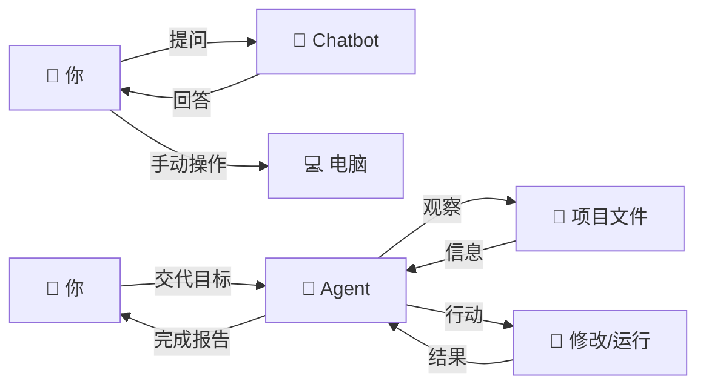
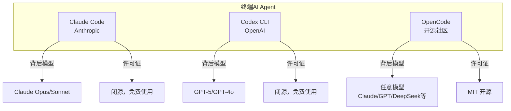
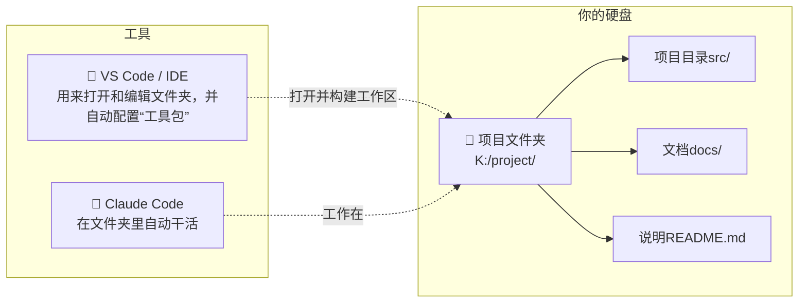
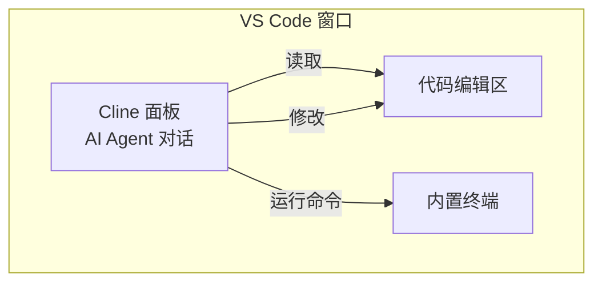
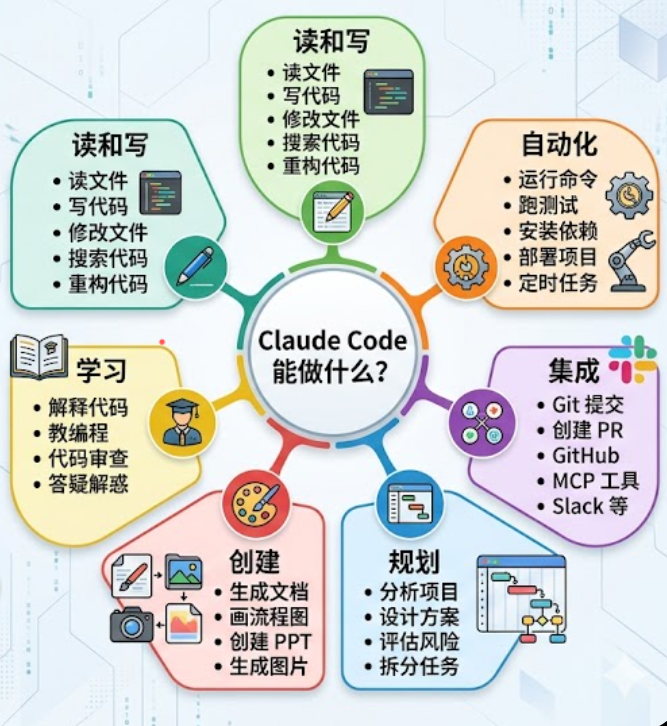

# 第二章：Claude Code 是什么 — 概念对比

> **本章目标**：理解 Claude Code 到底是什么，它和我们熟悉的 AI 工具有什么本质区别，以及为什么它值得学习。

---

## 2.1 一句话讲清楚 Claude Code

**Claude Code 是一个能读你的代码、改你的文件、帮你跑命令的 AI 编程助手。**

把它想象成一个**住在你电脑终端里的高级程序员同事**：

- 你告诉它"帮我把这个 Bug 修了"，它就去读代码、找问题、改文件
- 你告诉它"给我写一个登录功能"，它就创建文件、写代码、跑测试
- 你告诉它"这些代码太乱了，整理一下"，它就帮你重构
- ***当然不仅仅是写代码，还能做很多事

```
传统编程方式：
  你思考 → 你写代码 → 你运行 → 你调试 → 你修 Bug
  ─────────────────────────────────────────────
  全程你自己干

Claude Code 方式：
  你描述需求 → Claude Code 读代码 → Claude Code 写代码
  → Claude Code 运行测试 → Claude Code 修 Bug → 你看结果
  ─────────────────────────────────────────────
  你只需要描述想要什么 + 审核结果
```

---

## 2.2 四种使用方式对比

Claude Code 有四种使用形态，选哪个取决于你的具体情况：

```
┌──────────────────────────────────────────────────────────┐
│                 Claude Code 的四种形态                     │
│                                                          │
│  ┌──────────┐  ┌──────────┐  ┌──────────┐  ┌──────────┐ │
│  │  终端版   │  │ 桌面程序  │  │ VS Code  │  │  网页版   │ │
│  │ (CLI)    │  │ (Desktop)│  │  插件    │  │  (Web)   │ │
│  ├──────────┤  ├──────────┤  ├──────────┤  ├──────────┤ │
│  │ ⭐推荐   │  │ 需账号   │  │ 需账号   │  │ 需账号   │ │
│  │ 第三方API│  │ 风控严格  │  │ 编辑器中  │  │ 功能受限  │ │
│  └──────────┘  └──────────┘  └──────────┘  └──────────┘ │
└──────────────────────────────────────────────────────────┘
```

### 为什么本教程只推荐终端版（CLI）？

核心原因只有一条：

> **终端版支持配置第三方 API Key**，可以绕过 Anthropic 官方账号验证。

解释一下这个"死循环"问题：

```
很多新手的遭遇：
  想用 Claude Code → 需要 Claude 账号
  → 注册 Claude 账号 → 需要海外手机号验证
  → 好不容易搞到账号 → 付费订阅 Claude Pro
  → 用了几天 → 账号被封（风控判定为异常区域）
  → 钱白花了，工具也用不了
  → END ❌

推荐的路径（本教程）：
  想用 Claude Code → 安装终端版
  → 获取第三方 API Key（如 DeepSeek、OpenAI 等）
  → 配置到 Claude Code
  → 按使用量付费，不封号
  → 正常工作 ✅
```

> 💡 **在第八章**，我们会详细讲解如何配置第三方 API。总之建议用终端版，桌面版可能用不了。

---

## 2.3 "ChatGPT 网页版" vs "Claude Code" —— 本质区别

这是新手最容易困惑的问题。很多人说："我一直在用 ChatGPT/Deepseek 帮忙写代码啊，Claude Code 不就是换了个 AI 吗？"

**不是的。区别很大。**

### 你看这个表格就懂了：

| 维度       | ChatGPT 网页版             | Claude Code               |
| -------- | ----------------------- | ------------------------- |
| **使用场所** | 浏览器里打开网页                | 电脑终端里运行                   |
| **交互方式** | 你把代码复制粘贴过去，它回复，你再复制粘贴回来 | 它直接在你项目文件夹里读文件、改文件        |
| **工作范围** | 只能看到你粘贴的那一小段代码          | 能看到你整个项目的所有文件             |
| **能做什么** | 聊天、给建议、写代码片段            | 改文件、跑命令、创建提交、管理项目         |
| **操作模式** | 你问 → 它答 → 你手动操作         | 你描述目标 → 它规划 → 它自动执行 → 你审核 |
| **比喻**   | 有个老师在你旁边，你问一句它答一句       | 有个同事在你工位上，你交代任务它直接干       |

### 举个具体例子

**场景**：你的项目中有一个登录功能坏了。

**用 ChatGPT 网页版**：
```
你：（复制粘贴 login.js 的代码）
    "这段登录代码出错：Cannot read property 'token' of undefined，帮看下"

ChatGPT：问题是第45行没有检查 user 对象是否存在。
        应该改成：const token = user?.token || '';

你：好的（复制代码，粘贴回文件，手动测试，发现还不行）

你：（再次复制粘贴新的错误信息）"改了还不行，现在报401错误"

ChatGPT：看起来后端API地址可能不对...

你：（又复制粘贴 config.js）"这是配置文件"

...反复粘贴、聊天、粘贴，5轮之后终于修好
整个过程：20分钟，你手动操作了所有步骤
```

**用 Claude Code**：
```
你：帮我修一下登录功能，现在登录后报 Cannot read property 'token' of undefined

Claude Code：（自动读取 login.js）
          （自动读取 config.js、auth.js 等相关文件）
          （自动找到问题：第45行缺少空值检查 + 环境变量配置有误）
          （自动修改两个文件）
          （自动运行测试）
          "已修复两个问题：1. login.js第45行添加了可选链检查；
           2. .env中的API_BASE_URL指向了错误的地址。测试通过。"

整个过程：2分钟，你只发了一条指令，什么都没手动操作
```

这就是本质区别。Claude Code **不是聊天机器人**，它是一个**能动手干活的智能体（Agent）**。

---

## 2.4  什么是AI Agent？ ——Claude Code 的本质

上一节我们对比了 ChatGPT 和 Claude Code。现在来深入理解 Claude Code 的本质：**它不是一个"回答问题"的聊天机器人，而是一个能"动手干活"的 AI Agent（智能体）。**

### 2.4.1 你不是在和"聊天机器人"说话

**Chatbot（聊天机器人）**和 **Agent（智能体）**是两种完全不同的东西：



|            | Chatbot（聊天机器人）           | Agent（智能体）                     |
| ---------- | ------------------------ | ------------------------------ |
| **比喻**     | 电话里的顾问——只能给建议，你自己动手      | 坐在你工位上的同事——直接帮你干活              |
| **工作方式**   | 你问一句 → 它答一句 → 你手动操作      | 你交代目标 → 它自己循环执行 → 你审核结果        |
| **能做什么**   | 回答问题、给建议、写代码片段           | 读文件、改文件、跑命令、搜索代码、管理项目          |
| **代表**     | ChatGPT 网页版、DeepSeek 网页版 | **Claude Code**、Codex、OpenCode |
| **操作你的电脑** | ❌ 不能                     | ✅ 能                            |

> 🎯 **核心区别**：Chatbot 让你更聪明，Agent 让你更省力。Chatbot 告诉你"该怎么修"，Agent **直接帮你修好**。

Agent 的工作方式叫做 **Agent Loop**（智能体循环）：


详细的 Agent Loop 机制我们放到第五章再深入。现在只需要记住：**Agent 会自己循环干活，不用你一步步指挥。**

---

### 2.4.2  常见的三个 AI Agent：横向对比

目前主流的有三个在终端里跑的 AI Agent 工具：



| 对比维度         | Claude Code        | Codex CLI        | OpenCode          |
| ------------ | ------------------ | ---------------- | ----------------- |
| **开发商**      | Anthropic          | OpenAI           | 社区开源（MIT）         |
| **内置大模型**    | Claude 系列          | GPT 系列           | **不限**（可接任何模型）    |
| **是否开源**     | ❌ 闭源               | ❌ 闭源             | ✅ 完全开源            |
| **Skill 系统** | ✅ 完善的 Skill 生态     | ✅ 完善的 Skill 生态   | ❌ 无原生 Skill       |
| **MCP 支持**   | ✅ 原生深度支持           | ✅ 支持             | ✅ 支持              |
| **项目记忆**     | ✅ CLAUDE.md + 自动记忆 | 基础               | 基础                |
| **Git 集成**   | ✅ 提交/PR/审查         | ✅ Git checkpoint | 基础                |
| **子代理**      | ✅ 可派生子代理并行工作       | ✅ 可派生子代理         | ✅ 双代理（build/plan） |
| **LSP 支持**   | ✅ 代码智能补全           | ❌                | ✅                 |
| **安装方式**     | npm/brew/WinGet    | npm/brew         | npm/brew/cargo    |

**简单总结三者的定位**：

```
Claude Code  → 最"全能"。Skill 系统、MCP、自动化一应俱全，适合重度开发。
Codex CLI    → 最"轻便"。OpenAI 出品，如果你是 GPT 生态用户会更顺手。
OpenCode     → 最"自由"。开源、不绑定模型、可自己定制，适合喜欢动手折腾的人。
```

---

### 2.4.3 编辑器里的 AI Agent：Cline（VS Code 插件）

除了在终端里跑的 Agent，还有一种在编辑器里跑的。**Cline** 就是这类代表——它是 VS Code 的一个插件，让你在编辑器里直接使用 AI Agent。

#### 先搞懂：VS Code 是什么？它和记事本、Word 有什么区别？

很多新手对"文本编辑器"的概念模糊。用一张表说清楚：

|            | 记事本（Notepad） | Word          | VS Code                |
| ---------- | ------------ | ------------- | ---------------------- |
| **本质**     | 纯文本编辑器       | 文档排版工具        | 代码编辑器+IDE              |
| **能编辑什么**  | 纯文字（.txt）    | 带格式的文档（.docx） | 代码文件（.js/.py/.html...） |
| **有格式吗**   | ❌ 无          | ✅ 字体、颜色、排版... | ✅ 代码高亮、自动缩进...         |
| **给谁用的**   | 临时记点东西       | 写报告、做标书       | 写代码                    |
| **文件体积**   | 几 KB         | 几十到几百 KB      | 几 KB                   |
| **AI 能读吗** | ✅ 直接读        | ❌ 需要解析        | ✅ 直接读                  |

> 🎯 **一句话**：记事本是"草稿纸"，Word 是"排版印刷机"，VS Code 是"多功能工作台"。

#### IDE 又是什么？

**IDE** = Integrated Development Environment = **集成开发环境**。

听起来很复杂，其实就是：**编辑器 + 调试器 + 终端 + Git + 各种辅助工具，打包在一起**。

```
  VS Code（编辑器）      + 插件        ≈  IDE（开发环境）
  ┌─────────────┐    ┌───────────┐    ┌─────────────────┐
  │ 编辑代码      │    │ 代码补全    │    │                 │
  │ 打开文件      │ +  │ 调试工具    │ =  │  一站式代码工作台  │
  │ 切换文件夹    │    │ Git 管理   │    │                 │
  └─────────────┘    │ 终端集成    │    └─────────────────┘
                     └───────────┘
```

VS Code 本身是一个"轻编辑器"，但装了各种插件后，它就变成了一个功能完整的 IDE。这也是它最流行的原因。

#### 项目目录 vs IDE

这也是新手常混淆的概念：



> 🎯 **核心理解**：**项目目录就是你的文件夹**，IDE 和 Claude Code 都是"工具"——它们打开这个文件夹帮你干活。文件夹是主角，工具是配角。

#### Cline：把 AI Agent 装进 VS Code

**Cline** 是一个 VS Code 插件，它在编辑器里嵌入了一个 AI Agent：



| 对比 | Claude Code（终端版） | Cline（VS Code 插件） |
|------|---------------------|----------------------|
| **使用场所** | 终端窗口 | VS Code 编辑器侧边栏 |
| **视觉体验** | 纯文字 | 图形界面，代码在左边、对话在右边 |
| **Agent 能力** | ✅ 完整 | ✅ 完整 |
| **模型选择** | 第三方 API 灵活配置 | 支持多种 API |
| **适合谁** | 喜欢键盘操作、自动化脚本 | 喜欢图形界面、边看代码边对话 |
| **缺点** | 没有图形界面 | 必须打开 VS Code |

> 💡 **Cline 和 Claude Code 不是竞争关系**——它们本质上是同一个 Agent 理念的两种呈现形式。终端版更纯粹、更适合自动化；插件版更直观、更适合边看边改。

---

### 2.4.4 你应该选哪个？

没有标准答案，看你的习惯：

```
你喜欢用键盘，追求效率 → Claude Code / Codex CLI / OpenCode（终端里跑）
你喜欢在编辑器里看代码边对话 → Cline（VS Code 插件）
你不想折腾安装 → 先在网页版 ChatGPT/DeepSeek 玩着，但记住它不会自动帮你干活
你想完全掌控、自己定制 → OpenCode（开源）
```

> 🎯 **本教程选择 Claude Code 作为教学主线**，但学完本教程后，你对 AI Agent 工具都会有一个更清晰的认识。

---

## 2.5 Claude Code 能力全景图

让你对它能做什么有一个完整印象：

> 🎯 简单说：**任何跟代码和文件相关的任务，你都可以试试交给 Claude Code。**

---

## 2.6 常见的三个认知误区

### 误区一："AI 写的代码肯定不靠谱"

**真相**：Claude Code 不是只写代码——它写完后会**自己运行测试**验证是否通过。你还可以让它解释每一行代码在干什么。你始终是审核者，AI 是执行者。

### 误区二："我需要先学会编程才能用 Claude Code"

**真相**：不会编程也能用。你可以用自然语言（中文、英文都行）告诉 Claude Code 你想做什么。当然，懂一些编程基础能让你更高效地审核它的产出——但这完全可以在使用过程中慢慢学。

### 误区三："免费的 ChatGPT 也能干这些，为什么要折腾安装 Claude Code"

**真相**：免费版 ChatGPT 不能自动读你的项目文件、不能改文件、不能跑命令、不能管理 Git。这种"自动干活"的能力，是 Claude Code 的本质区别。

---

## 本章小结

| 你学到了什么 | 一句话总结 |
|-------------|-----------|
| Claude Code 是什么 | 住在终端里、能自动干活的 AI 编程助手 |
| 四种使用形态 | CLI/Desktop/VS Code/Web，推荐 CLI（支持第三方 API） |
| 和 ChatGPT 的区别 | ChatGPT 是"聊天顾问"，Claude Code 是"动手干活的同事" |
| AI Agent 是什么 | 能自己循环干活的智能体，不是只会聊天的机器人 |
| 终端 Agent 对比 | Claude Code 最全能，Codex CLI 最轻便，OpenCode 最自由 |
| 编辑器 Agent | Cline（VS Code 插件）在图形界面里提供 Agent 能力 |
| VS Code / IDE | VS Code 是代码编辑器，装插件后变成 IDE（集成开发环境） |

> 📌 **下一章**：[第三章：安装 Claude Code](./03-安装Claude-Code.md)  
> 我们将一步步在 Windows 上安装 Claude Code，配有每个步骤的详细说明。
