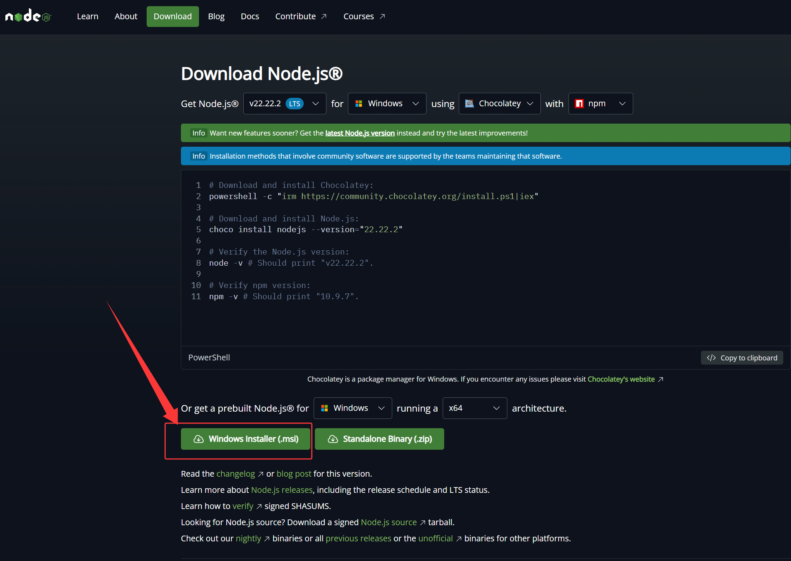

# 第三章：安装 Claude Code

> **本章目标**：在 Windows 上安装 Claude Code。本章介绍四种安装方法，按优先级排列，请从上到下依次尝试，**选第一种能成功的方法即可**。

---

## 3.1 四种安装方法速览

Claude Code 在 Windows 上有四种安装方式，核心区别在于**是否需要额外工具**和**是否需要网络代理（科学上网）**：

| 优先级 | 安装方式 | 一条命令搞定 | 需要前置工具 | 需要代理 |
|:---:|---------|------------|:---:|:---:|
| ⭐1 | **winget** | `winget install Anthropic.ClaudeCode` | 无 | ❌ 不需要 |
| ⭐2 | **npm** | `npm install -g @anthropic-ai/claude-code` | Node.js | ❌ 不需要 |
| 3 | **irm 官方脚本** | `irm https://claude.ai/install.ps1 \| iex` | 无 | ✅ 需要 |
| 4 | **curl.exe** | `curl.exe -fsSL https://claude.ai/install.cmd -o install.cmd && .\install.cmd` | 无 | ✅ 需要 |

**为什么有的需要代理，有的不需要？**

- winget 从**微软服务器**下载软件 → 国内网络可直接访问
- npm 从 **npm 官方仓库**下载 → 国内网络可直接访问
- irm 和 curl.exe 直接从 **claude.ai** 下载 → 国内网络可能需要代理才能访问

> 💡 **阅读建议**：按优先级从上到下尝试。方法 1 或 2 成功后，后面的就不用看了。只有当前面所有方法都失败时，才需要看到后面。

---

## 3.2 安装前的准备

并非所有安装方法都需要前置工具。下面是四种方法各自的前置要求：

| 安装方法 | 需要准备什么 |
|---------|------------|
| winget | 无。但 Win10 可能需要先装 winget（见 3.3） |
| npm | 需要先装 **Node.js** |
| irm | 无。但需要 PowerShell 执行策略允许（见 3.5） |
| curl.exe | 无 |

### 安装 Node.js（仅 npm 方法需要）

如果你打算用方法一（winget），可以跳过这里直接看 3.3。只有方法二（npm）才需要 Node.js。

**检查是否已安装：** 打开 PowerShell，输入：

```powershell
node --version
```

- 输出类似 `v22.11.0` → 已装好，跳到 3.4
- 显示"不是内部或外部命令" → 按下面步骤安装

**安装步骤：**

```
┌────────────────────────────────────────────┐
│          Node.js 安装步骤                    │
│                                            │
│  1. 浏览器打开: https://nodejs.org          │
│     ┌──────────────────────────┐           │
│     │  [Download Node.js (LTS)]│ ← 点这里  │
│     └──────────────────────────┘           │
│     ⚠️ 选 LTS 版本（长期支持版），           │
│     不要选 Current（最新实验版）              │
│                                            │
│  2. 下载完成后双击运行安装程序               │
│                                            │
│  3. 一路点 "Next"（保持默认选项即可）        │
│     ⚠️ 安装过程全部默认，不要改任何选项       │
│                                            │
│  4. 安装完毕后，关闭并重新打开 PowerShell     │
│     输入 node --version 验证                │
│                                            │
└────────────────────────────────────────────┘
```



> 💡 安装包大约 30MB，下载可能需要几分钟。

---

## 3.3 方法一：winget 安装（⭐ 首选推荐）

**winget** 是 Windows 自带的**包管理器**。用人话解释：它就像手机上的"应用商店"，只不过是在命令行里用，输入一个命令就能自动下载并装好软件，不需要打开浏览器。

winget 从微软的官方仓库下载软件，**不需要代理**，而且安装过程最简单。

### 第一步：检查 winget 是否可用

打开 PowerShell，输入：

```powershell
winget --version
```

- 输出版本号（如 `v1.9.25200`）→ 直接跳到"第二步：安装 Claude Code"
- 提示"不是内部或外部命令" → 继续看下面的"安装 winget"

### Win10 安装 winget

**Windows 11 自带 winget**，不需要这一步。但部分 Windows 10 系统可能没有预装。

**方法 A：从微软商店安装（推荐）**

1. 打开 **Microsoft Store**（微软应用商店）
2. 搜索 **"应用安装程序"**（App Installer）
3. 点击 **安装** 或 **更新**
4. 完成后，关闭并重新打开 PowerShell，输入 `winget --version` 验证

**方法 B：从 GitHub 下载**

如果方法 A 不成功：

1. 浏览器打开：`https://github.com/microsoft/winget-cli/releases`
2. 找到最新的 Release，下载 `.msixbundle` 文件
3. 双击安装，然后重新打开 PowerShell 验证

### 第二步：安装 Claude Code

```powershell
winget install Anthropic.ClaudeCode
```

这条命令会自动完成下载、安装、添加到系统路径——你只需要等它跑完就好。

预期输出中会出现安装进度条和完成提示。完成后**关闭并重新打开 PowerShell**，然后跳到 3.7 验证。

---

## 3.4 方法二：npm 安装（⭐ 推荐）

如果你已经有 Node.js，或者不想折腾 winget，npm 安装也是一条命令搞定，**不需要代理**。

> 📦 **前置条件**：确认 Node.js 已安装（`node --version` 能输出版本号）。如果还没装，回到 3.2 装好再继续。

### 安装命令

```powershell
npm install -g @anthropic-ai/claude-code
```

拆开解释一下这条命令在干什么：

| 命令部分 | 含义 |
|---------|------|
| `npm install` | 用 npm（Node.js 的包管理器）安装一个软件包 |
| `-g` | **全局安装**（global），装到系统里，所有项目都能用 |
| `@anthropic-ai/claude-code` | 包名，Claude Code 在 npm 仓库里的名字 |

### 预期输出

安装过程中会显示下载进度，最后输出类似：

```
added 123 packages in 15s
```

### 可能遇到的问题

> ⚠️ 如果报错包含 `EACCES` 或 `permission denied`（权限不足）：
> ```powershell
> npm install -g @anthropic-ai/claude-code --userconfig=""
> ```

安装完成后**关闭并重新打开 PowerShell**，跳到 3.7 验证。

---

## 3.5 方法三：官方 irm 脚本安装（有代理时使用）

如果你已经**配置了网络代理（科学上网）**，可以直接运行 Anthropic 官方的一键安装脚本。这是最"官方原生"的安装方式。

### 安装命令

```powershell
irm https://claude.ai/install.ps1 | iex
```

**拆开看这条命令在干什么：**

| 命令部分 | 含义 |
|---------|------|
| `irm` | 从网上下载文件（**I**nvoke **R**est **M**ethod） |
| `https://claude.ai/install.ps1` | 从 Claude 官网下载这个安装脚本 |
| `\|` | **管道符**，把上一步下载的内容"传"给下一步 |
| `iex` | 执行传过来的脚本内容（**I**nvoke **Ex**pression） |

> 💡 整句话的意思是："去 Claude 官网把安装脚本下载下来，直接运行。"

### 常见报错一：PowerShell 执行策略限制

如果运行后出现红字报错，提示类似：

```
irm : File xxx cannot be loaded because running scripts is disabled 
on this system.
```

**原因**：Windows 出于安全考虑，默认禁止运行从网上下载的 PowerShell 脚本。这叫**执行策略（Execution Policy）**限制。

**解决方法：** 先运行下面这条命令，再执行安装：

```powershell
Set-ExecutionPolicy -Scope CurrentUser RemoteSigned
```

这条命令的意思是："允许当前用户运行自己写的脚本，以及经过数字签名的远程脚本。"

> ⚠️ **如果这条命令也报错了**，提示"无法修改，因为被组策略（Group Policy）设置"：
> 
> 这说明你的电脑由公司/学校 IT 部门统一管理，组策略锁死了执行策略，个人无法修改。**请直接跳到 3.6，使用 curl.exe 方法。**

### 常见报错二：网络连接失败（403 Forbidden 或超时）

如果运行 `irm` 后长时间卡住没反应，或者提示 `403 Forbidden`、`Connection timed out`：

**原因**：`claude.ai` 在国内网络下无法直接访问，需要通过代理。

**解决方法：** 先设置代理环境变量，再运行安装命令：

```powershell
# 设置代理（请替换成你的实际代理地址和端口）
$env:HTTPS_PROXY = "http://127.0.0.1:7890"

# 然后运行安装
irm https://claude.ai/install.ps1 | iex
```

> 💡 常见代理软件的默认端口：Clash → `7890`，V2Ray → `10809`，SSR → `1080`。如果不确定，打开你的代理软件设置里查看。

---

## 3.6 方法四：curl.exe 安装（备选方案）

这是最后一种备选方案。适合以下场景：

- PowerShell 被组策略锁了执行策略，无法修改（3.5 的报错一）
- 有代理但 irm 方式仍然失败
- 想在 **CMD（命令提示符）** 而不是 PowerShell 中安装

### ⚠️ 关键注意：必须写 `curl.exe`，不能只写 `curl`

在 PowerShell 中直接输入 `curl`，**会被当成 `Invoke-WebRequest` 的别名**，而不是真正的 curl 工具，导致行为异常或报错。**一定要写完整的 `curl.exe`。**

> 💡 怎么判断自己在 PowerShell 还是 CMD？看提示符：`PS C:\>` 开头 = PowerShell，纯 `C:\>` 开头 = CMD。

### 在 PowerShell 中安装（无代理）

```powershell
curl.exe -fsSL https://claude.ai/install.cmd -o install.cmd && .\install.cmd && del install.cmd
```

拆开解释：

| 命令部分 | 含义 |
|---------|------|
| `curl.exe -fsSL` | 调用真正的 curl 下载文件（`-f` 失败时报错，`-sS` 静默但显示错误，`-L` 跟随重定向） |
| `https://claude.ai/install.cmd` | 从官网下载安装脚本 |
| `-o install.cmd` | 保存为 `install.cmd` 文件 |
| `&& .\install.cmd` | 运行下载的安装脚本 |
| `&& del install.cmd` | 安装完后删除脚本，清理干净 |

### 在 CMD（命令提示符）中安装

```cmd
curl.exe -fsSL https://claude.ai/install.cmd -o install.cmd && install.cmd && del install.cmd
```

CMD 中运行本地脚本不需要 `.\` 前缀，其他部分一样。

### curl.exe 走代理

如果 `claude.ai` 访问不了（403 或超时），有两种方式给 curl 配置代理：

**方式一：直接在命令里指定代理（推荐，最直接）**

```powershell
# 把 --proxy 后面的地址换成你自己的代理
curl.exe -fsSL https://claude.ai/install.cmd -o install.cmd --proxy http://127.0.0.1:7890 && .\install.cmd && del install.cmd
```

**方式二：先设置环境变量（适合多次使用）**

```powershell
# 设置代理环境变量（替换成你的代理地址）
$env:HTTPS_PROXY = "http://127.0.0.1:7890"
$env:HTTP_PROXY = "http://127.0.0.1:7890"

# 然后运行 curl.exe（它会自动读取环境变量里的代理设置）
curl.exe -fsSL https://claude.ai/install.cmd -o install.cmd && .\install.cmd && del install.cmd
```

> 💡 常见代理端口：Clash → `7890`，V2Ray → `10809`，SSR → `1080`。如果不确定，打开你的代理软件设置查看"HTTP 代理端口"。

---

## 3.7 验证安装是否成功

**不论用哪种方法安装，验证步骤都一样。**

关闭并重新打开 PowerShell（这很重要！刚装完系统可能还没刷新），输入：

```powershell
claude --version
```

如果输出类似：

```
2.1.xxx (Claude Code)
```

🎉 恭喜，安装成功！可以进入第四章开始使用了。

### 如果提示 "claude 不是内部或外部命令"

这说明系统没找到 Claude Code，按顺序排查：

```
排查步骤：

1. 确保关闭了所有 PowerShell 窗口，重新打开一个新的
2. 在新窗口中再次运行 claude --version
3. 如果还不行，试试重启电脑
4. 重启后仍然不行 → 用原来的安装方法重新装一次
5. 反复失败 → 换一种安装方法试试（比如从 npm 换成 winget）
```

---

## 3.8 更新与卸载

### 更新 Claude Code

不同安装方式的更新方法不同：

| 安装方式 | 更新命令 |
|---------|---------|
| winget | `winget upgrade Anthropic.ClaudeCode`（**不会自动更新**，需要手动执行） |
| npm | 通常会**自动更新**。手动更新：`claude --update` |
| irm / curl.exe | 通常会**自动更新**。手动更新：`claude --update` |

### 卸载 Claude Code

```powershell
# npm 或官方脚本安装的
claude --uninstall

# winget 安装的
winget uninstall Anthropic.ClaudeCode
```

---

## 本章小结

**四种方法的决策流程：**

```
你用什么方式安装？
│
├─ 先试→ winget install Anthropic.ClaudeCode   （不需要代理，最简单）
│         └─ Win10 没有 winget？去微软商店装一下
│
├─ 备选→ npm install -g @anthropic-ai/claude-code  （需要 Node.js，不需要代理）
│
├─ 有代理→ irm https://claude.ai/install.ps1 | iex   （官方原生脚本）
│          └─ 遇到执行策略限制？Set-ExecutionPolicy 解除
│          └─ 被组策略锁死了？改用 curl.exe ↓
│
└─ 最后→ curl.exe ... --proxy ...   （最灵活，能绕过组策略，能指定代理）
```

**核心思路**：winget 和 npm 不需要代理，优先尝试。irm 和 curl.exe 需要代理，但有更多的灵活性（可指定代理、可绕过执行策略限制）。

| 场景 | 推荐方法 |
|------|---------|
| Windows 11，不想折腾 | `winget install Anthropic.ClaudeCode` |
| 有 Node.js，没有 winget | `npm install -g @anthropic-ai/claude-code` |
| 有代理，能访问 claude.ai | `irm https://claude.ai/install.ps1 \| iex` |
| 组策略锁了 PowerShell + 有代理 | `curl.exe -fsSL ... --proxy http://127.0.0.1:7890` |

> 📌 **下一章**：[第四章：第一次运行和基本对话](./04-第一次运行.md)  
> 安装好了，让我们启动 Claude Code，开始第一次对话。
