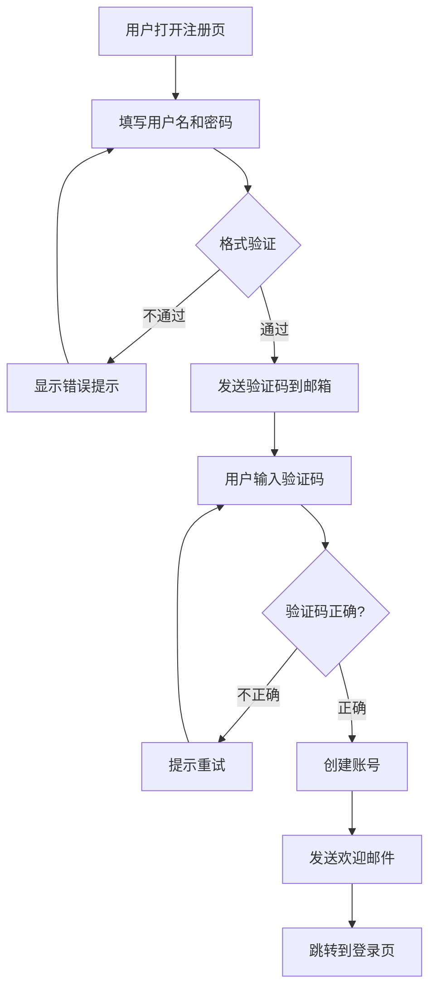

# 第七章：实用能力教程

> **本章目标**：通过真实场景案例，掌握 Claude Code 的日常实用能力。每个场景配有完整命令和预期输出。

---

## 7.1 整理文件和组织代码

### 场景一：整理杂乱的下载文件夹

你的 `Downloads` 文件夹里有几百个文件，散乱的 PDF、图片、安装包、文档混在一起。

```powershell
cd ~/Downloads
claude
```

然后告诉 Claude：

```
> 帮我整理这个文件夹：
  1. 把文件按类型分到子文件夹：PDF/、图片/、安装包/、文档/、其他/
  2. 图片按创建日期再分一层（2026-01/、2026-02/ 这样）
  3. 把重复文件找出来（文件名相似或内容相同），列个报告给我
```

Claude Code 会：
1. 用 `ls` 列出所有文件
2. 规划分类方案
3. 用 `mkdir` 创建文件夹
4. 用 `mv` 移动文件
5. 去重分析

---

### 场景二：重构凌乱的项目代码

你的项目刚开始只是写了个原型，现在 `src/` 下 20 个文件全堆在一起。

```
> 帮我整理一下 src/ 目录：
  1. 组件放到 src/components/
  2. 工具函数放到 src/utils/
  3. 类型定义放到 src/types/
  4. API 请求代码放到 src/api/
  5. 更新所有 import 语句
  6. 最后运行 npm test 确保没搞坏
```

Claude Code 会自动：
1. 分析每个文件的用途
2. 创建目标目录
3. 移动文件
4. 更新所有引用路径
5. 运行测试验证

---

### 场景三：批量重命名

```
> 把所有 src/components/ 下的 .jsx 文件改成 .tsx，并且把文件名改成 PascalCase
  （例如：user-profile.jsx → UserProfile.tsx）
  如果有 import 语句引用了这些文件，也一并更新
```

---

## 7.2 设计绘图

Claude Code 能生成多种格式的图。

### ASCII 图（直接在终端里看）

```
> 帮我用 ASCII 画一个微服务架构图，
  包含：API Gateway → User Service / Order Service / Payment Service → 数据库
```

Claude 会生成类似这样的图：

```
                    ┌──────────────┐
                    │   Client     │
                    └──────┬───────┘
                           │
                    ┌──────▼───────┐
                    │  API Gateway │
                    └──────┬───────┘
                           │
          ┌────────────────┼────────────────┐
          │                │                │
   ┌──────▼──────┐ ┌──────▼──────┐ ┌──────▼──────┐
   │ User Service│ │Order Service│ │Pay  Service │
   └──────┬──────┘ └──────┬──────┘ └──────┬──────┘
          │                │                │
   ┌──────▼──────┐ ┌──────▼──────┐ ┌──────▼──────┐
   │  User DB    │ │  Order DB   │ │  Pay  DB    │
   │ (Postgres)  │ │  (MongoDB)  │ │  (Redis)    │
   └─────────────┘ └─────────────┘ └─────────────┘
```

---

### Mermaid 流程图（渲染为 SVG/PNG）

```
> 帮我画一个用户注册流程图，用 Mermaid 格式，
  保存为 docs/register-flow.md
```

Claude 生成 Mermaid 代码：

````markdown

````


>💡 Mermaid 图可以在 VS Code、GitHub、Notion 等平台直接渲染为图表(如上图)。你只需要装一个 Mermaid 预览插件。


> 💡你也可以让你的ai agent （codex）直接生成图片：

````markdown

根据以上内容，生成一个简洁活泼的流程图，9：16，竖版格式
````


---

### HTML 交互式图表（打开浏览器看）

```
> 帮我生成一个交互式柱状图：显示今年每月的销售额，
  颜色用橙色渐变，鼠标悬停显示具体数字，
  保存为 sales-chart.html 并在浏览器打开
```

Claude 会生成包含 Chart.js 的完整 HTML 页面，自动在浏览器打开。

---

## 7.3 创建 PPT / 演示文稿

Claude Code 不能直接生成 `.pptx` 文件（那是 Microsoft Office 的私有格式），但可以通过几种方式创建演示文稿。

### 方法一：生成 HTML 幻灯片（最推荐）

```
> 帮我做一个 5 页的产品介绍幻灯片：
  第1页：封面（产品名、标语）
  第2页：我们的痛点（三个行业问题）
  第3页：解决方案（我们的产品如何解决）
  第4页：核心功能（四个功能图标+描述）
  第5页：行动号召（联系方式、试用链接）

  要求：
  - 深色主题，现代风格
  - 用键盘左右箭头翻页
  - 保存为 slides.html
```

生成的是一个独立的 HTML 文件，在浏览器打开就能翻页演示。效果跟 PPT 一样，还不需要 PowerPoint。

### 方法二：用 Python 生成 .pptx

```
> 用 python-pptx 库帮我创建一个 PPT：
  1. 先 pip install python-pptx
  2. 创建 5 页幻灯片（主题：Claude Code 入门）
  3. 第1页标题页，后面4页内容页
  4. 保存为 claude-code-intro.pptx
```

### 方法三：生成 Markdown → 转 PPT

```
> 帮我把这个教程的第五章"核心概念"转成演示文稿格式：
  1. 生成一个 markdown 版本的幻灯片（用 --- 分页）
  2. 安装 marp-cli（npm i -g @marp-team/marp-cli）
  3. 用 marp 命令转成 PPT
```

> 💡 **Marp** 是一个把 Markdown 转成 PPT 的工具，非常适合程序员做演示。

---

## 7.4 用 Claude Code 写教程/文档

是的，本教程就是 Claude Code 协助创作的。

### 实例：用 Claude Code 写一个 API 文档

```
> 看一遍 src/api/ 下的所有文件，然后帮我写一份完整的 API 文档：
  1. 每个接口的 URL、方法、参数、返回值
  2. 每个接口配一个请求示例和一个返回示例
  3. 用 Markdown 格式，保存为 docs/api-documentation.md
  4. 文件末尾加一个"常见问题"章节
```

### 实例：翻译文档

```
> 把 docs/README.md 翻译成英文，
  保持 Markdown 格式和代码块不变，
  保存为 docs/README.en.md
```

### 实例：生成 CHANGELOG

```
> 看一遍 git log 自从上次发布以来的所有提交，
  写一个 CHANGELOG.md，按 feat/fix/breaking 分类
```

---

## 7.5 常见工作流（Common Workflows）

### 工作流一：修 Bug（最常用的工作流）

```
场景：用户报了一个 Bug

> 用户反馈点击"加入购物车"按钮后页面没有反应。
  帮我排查一下。先看看 browser console 有没有报错，
  然后顺着 ShoppingCart 组件找原因。
```

Claude Code 的标准流程：

```
读 ShoppingCart.jsx → 读相关的 addToCart action
→ 发现第 37 行没有处理网络错误
→ 修改代码，添加 try-catch
→ 运行测试验证
→ 告诉你修了什么，为什么这样修
```

### 工作流二：添加新功能

```
> 给项目加一个"收藏"功能：
  1. 创建 FavoriteButton 组件（空心❤️，点击变实心❤️）
  2. 组件放在 src/components/
  3. 用 Tailwind CSS 写样式
  4. 状态用 localStorage 持久化
  5. 写一个单元测试
  6. 在主页引入这个组件
```

### 工作流三：写测试

```
> 帮我给 src/utils/formatDate.js 补充测试用例：
  1. 正常日期格式化
  2. 边界：null、undefined、空字符串
  3. 边界：1970-01-01、2099-12-31
  4. 国际化：中文和英文日期格式
```

### 工作流四：代码审查（提交前自查）

```
> 帮我 review 一下暂存区里要提交的改动：
  /review
```

或者：

```
> diff 一下 main 分支和我当前的改动，
  帮我检查有没有安全问题、性能问题、明显的 bug
```

### 工作流五：Git 提交 + 创建 PR

```
> 帮我看看当前改了什么
```

Claude 列出改动 → 你确认没问题后：

```
> 帮我提交这些改动
```

Claude 自动写规范的 commit message 并提交。

```
> 帮我基于 main 分支创建一个 PR，标题是 "feat: 添加用户收藏功能"
```

---

## 7.6 进阶用法：写脚本自动化

### 自动检查部署状态

```powershell
claude -p "检查 https://my-api.example.com/health 返回是否正常，如果不正常给团队发通知"
```

### 管道 + 分析

```powershell
# 分析最近的线上错误日志
tail -500 production.log | claude -p "分析这些错误日志，找出 Top 3 高频错误，给出修复建议"

# 对比两份配置文件
diff config.staging.json config.prod.json | claude -p "解释这些差异，标注哪些差异有安全风险"
```

---

## 本章小结

| 能力 | 典型命令 |
|------|---------|
| 整理文件 | "帮我把文件按类型分到子文件夹" |
| 重构代码 | "整理 src/，按组件/工具/类型拆分" |
| 画架构图 | "用 ASCII/Mermaid 画一个架构图" |
| 创建 PPT | "生成 HTML 幻灯片" 或 "用 python-pptx 创建" |
| 写文档 | "读一遍代码，生成 API 文档" |
| 修 Bug | "排查这个问题，找到根源并修复" |
| 写测试 | "给这个文件补充测试用例" |
| 提交 PR | "/commit 然后创建 PR" |
| 脚本自动化 | `claude -p "任务"` 或管道输入 |

> 📌 **下一章**：[第八章：第三方模型接入与计费详解](./08-第三方模型和计费.md)  
> 彻底解决"怎么用、怎么付钱"的问题。
